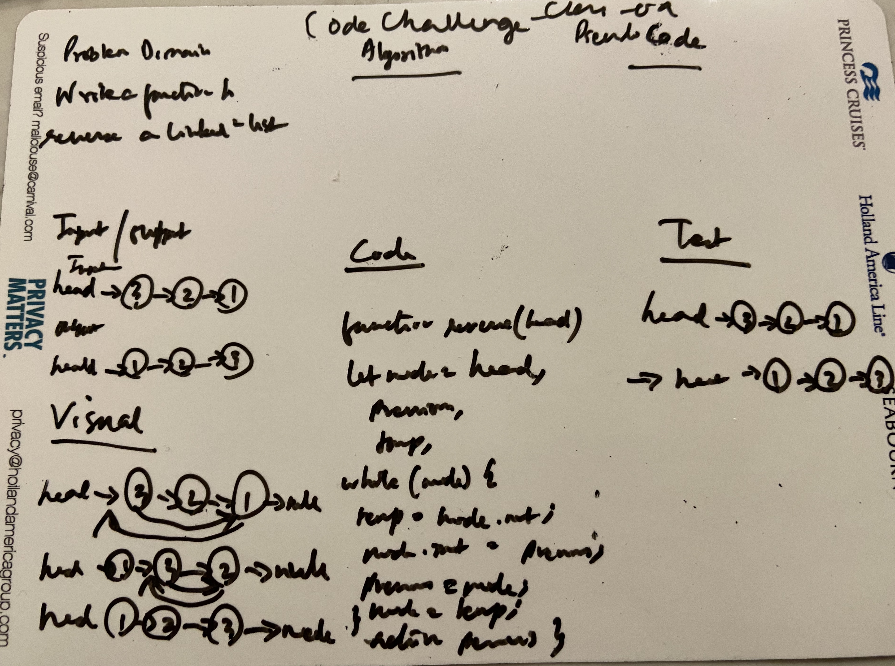

# Code Challenge: Class09

## Linked List

### Author: Shubham Majumdar

### Links and Resources
* [submission PR](https://github.com/401-advanced-javascript-Shubham/Lab01/pull/1)

# Challenge Summary
Write a function to reverse a Singly Linked List.

## Challenge Description
Write a function to reverse a Singly Linked List.

## Approach & Efficiency

## Solution

#### How to initialize/run your server app (where applicable)
* `npm start`
  
#### Tests
* How do you run tests?
npm test

Reference - https://wsvincent.com/javascript-reverse-linked-list/
