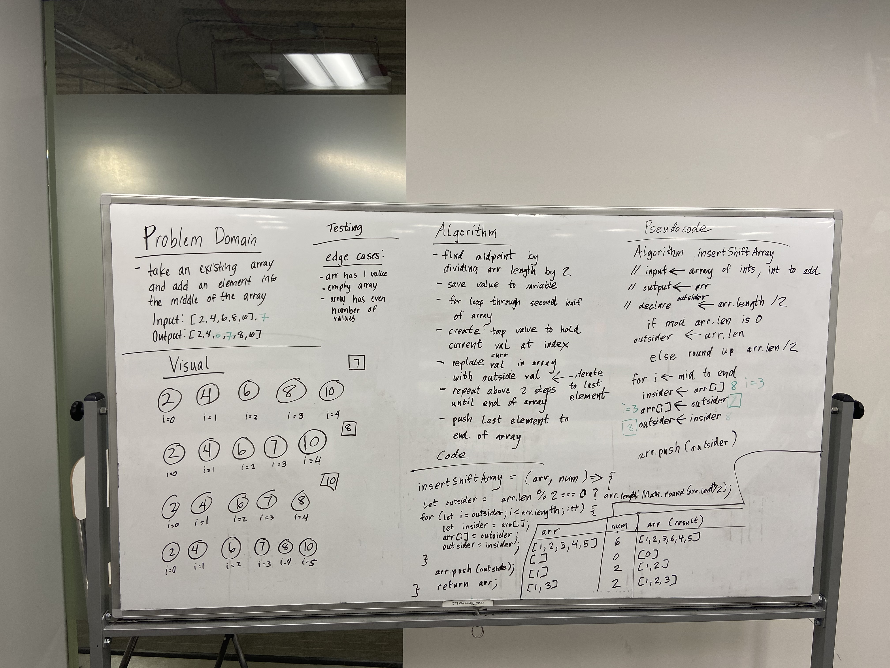

# Code Challenge: Class 02

## Array Shift

### Author: Shubham Majumdar

### Links and Resources
* [submission PR](https://github.com/smajumdar22/data-structures-and-algorithms/pull/50)

# Challenge Summary
Write a function called insertShiftArray which takes in an array and the value to be added. Without utilizing any of the built-in methods available to your language, return an array with the new value added at the middle index.

## Challenge Description
Write a function called insertShiftArray which takes in an array and the value to be added. Without utilizing any of the built-in methods available to your language, return an array with the new value added at the middle index.

## Approach & Efficiency
Used 2 variables insider and outsider where the element to be added is first initialized in outside variable.Iteration is started from the middle of array and as we iterate we replace outsider element to the right side of the middle array and replacing it with the previous outsider element.After iteration is over push the last element.

## Solution

#### How to initialize/run your server app (where applicable)
* `npm start`
  
#### Tests
* How do you run tests?
npm test

