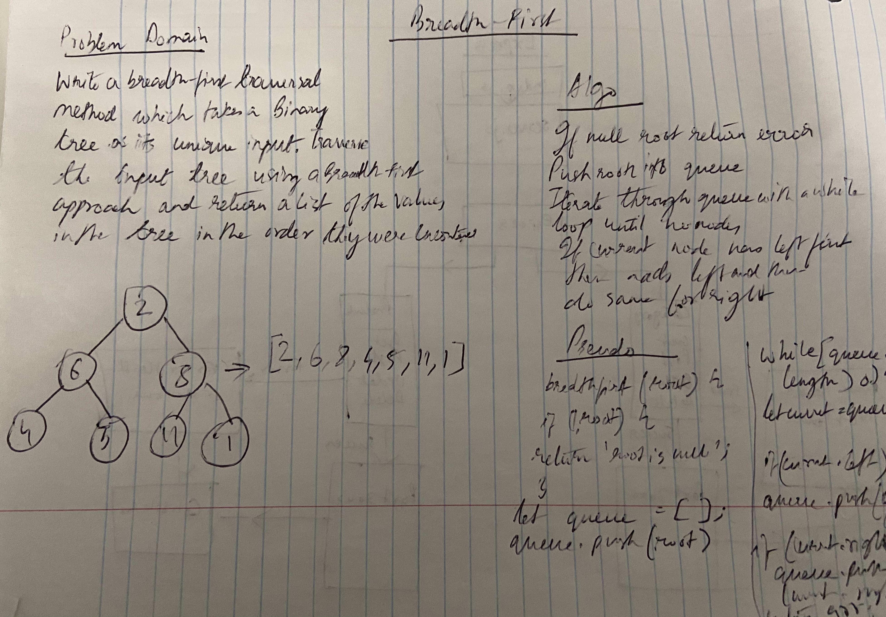

# Code Challenge: Class 17

## Breadth First Traverse

### Author: Shubham Majumdar

### Links and Resources
* [submission PR](https://github.com/smajumdar22/data-structures-and-algorithms/pull/44)

# Challenge Summary
Write a breadth first traversal method which takes a Binary Tree as its unique input. Without utilizing any of the built-in methods available to your language, traverse the input tree using a Breadth-first approach, and return a list of the values in the tree in the order they were encountered.
## Challenge Description
Write a breadth first traversal method which takes a Binary Tree as its unique input. Without utilizing any of the built-in methods available to your language, traverse the input tree using a Breadth-first approach, and return a list of the values in the tree in the order they were encountered.

## Approach & Efficiency

## Solution

#### How to initialize/run your server app (where applicable)
* `npm start`
  
#### Tests
* How do you run tests?
npm test

