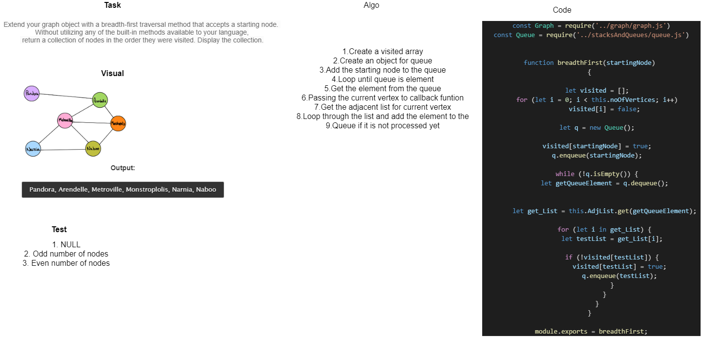

# Class 31 Code Challenge: Breadth First Graph

## Breadth First

### Author: Shubham Majumdar

### Links and Resources
* [submission PR](https://github.com/smajumdar22/data-structures-and-algorithms/pull/76)

# Challenge Summary
Extend your graph object with a breadth-first traversal method that accepts a starting node. Without utilizing any of the built-in methods available to your language, return a collection of nodes in the order they were visited. Display the collection.

## Challenge Description
Extend your graph object with a breadth-first traversal method that accepts a starting node. Without utilizing any of the built-in methods available to your language, return a collection of nodes in the order they were visited. Display the collection.

## Approach & Efficiency

## Solution

#### How to initialize/run your server app (where applicable)
* `npm start`
  
#### Tests
* How do you run tests?
npm test

