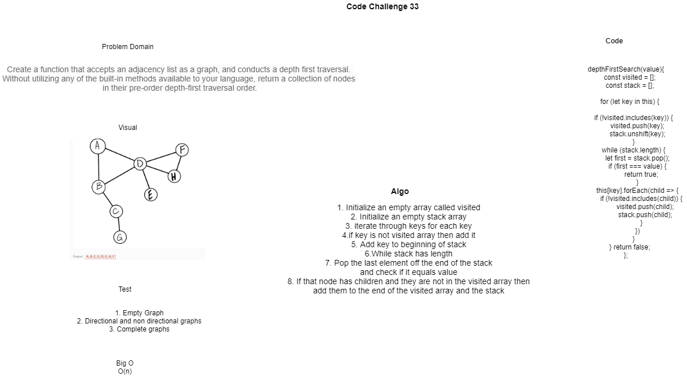

# Class 33 Code Challenge: Depth First

## Depth First

### Author: Shubham Majumdar

### Links and Resources
* [submission PR](https://github.com/smajumdar22/data-structures-and-algorithms/pull/79)

# Challenge Summary
Create a function that accepts an adjacency list as a graph, and conducts a depth first traversal. Without utilizing any of the built-in methods available to your language, return a collection of nodes in their pre-order depth-first traversal order.

## Challenge Description
Create a function that accepts an adjacency list as a graph, and conducts a depth first traversal. Without utilizing any of the built-in methods available to your language, return a collection of nodes in their pre-order depth-first traversal order.

## Approach & Efficiency

## Solution

#### How to initialize/run your server app (where applicable)
* `npm start`
  
#### Tests
* How do you run tests?
npm test

