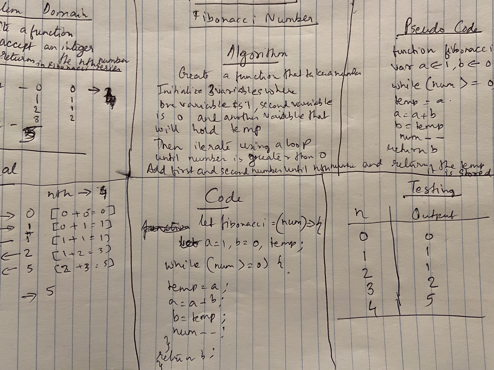

# Code Challenge: Class 04

## Fibonacci

### Author: Shubham Majumdar

### Links and Resources
* [submission PR](https://github.com/401-advanced-javascript-Shubham/Lab01/pull/1)

# Challenge Summary
Write a function to accepts an integer, and returns the nth number in the Fibonacci sequence.

## Challenge Description
Write a function to accepts an integer, and returns the nth number in the Fibonacci sequence.

## Approach & Efficiency
Use 3 variables.Two of them to store 0 and 1 and one variable as temporary to hold the final output.Then write a function that takes in a number and we iterate through a while loop to get the sum of the nth number and store it in the temporary variable.

## Solution

#### How to initialize/run your server app (where applicable)
* `npm start`
  
#### Tests
* How do you run tests?
npm test

