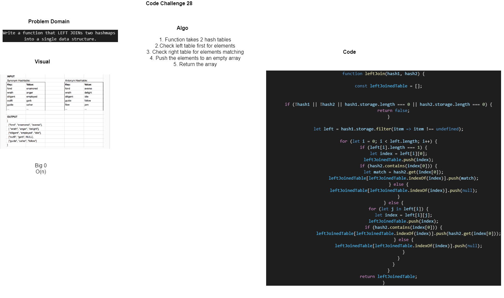

# Code Challenge 28: Left Join

## Left Join

### Author: Shubham Majumdar

### Links and Resources
* [submission PR](https://github.com/smajumdar22/data-structures-and-algorithms/pull/72)

# Challenge Summary
Write a function that LEFT JOINs two hashmaps into a single data structure.

## Challenge Description
Write a function that LEFT JOINs two hashmaps into a single data structure.

## Approach & Efficiency

## Solution

#### How to initialize/run your server app (where applicable)
* `npm start`
  
#### Tests
* How do you run tests?
npm test

