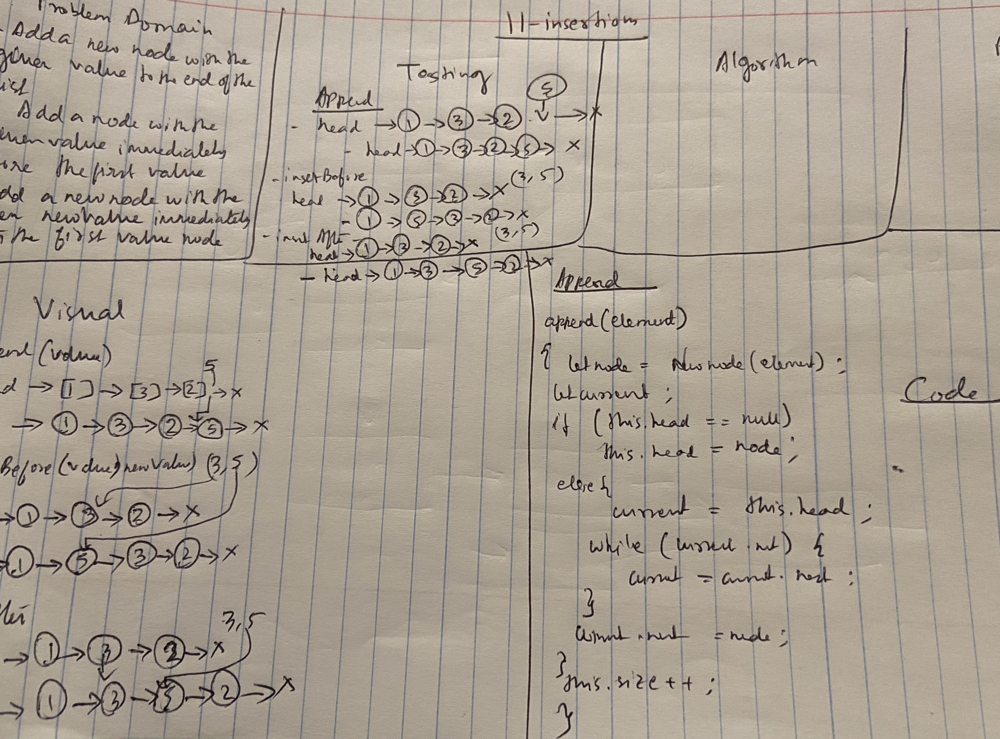

# Code Challenge: Class 07

## Linked List ll-insertion

### Author: Shubham Majumdar

### Links and Resources
* [submission PR](https://github.com/401-advanced-javascript-Shubham/Lab01/pull/1)

# Challenge Summary
Write the following methods for the Linked List class:

.append(value) which adds a new node with the given value to the end of the list
.insertBefore(value, newVal) which add a new node with the given newValue immediately before the first value node
.insertAfter(value, newVal) which add a new node with the given newValue immediately after the first value node
## Challenge Description
Write the following methods for the Linked List class:

.append(value) which adds a new node with the given value to the end of the list
.insertBefore(value, newVal) which add a new node with the given newValue immediately before the first value node
.insertAfter(value, newVal) which add a new node with the given newValue immediately after the first value node

## Approach & Efficiency

## Solution

#### How to initialize/run your server app (where applicable)
* `npm start`
  
#### Tests
* How do you run tests?
npm test

Reference - https://codereview.stackexchange.com/questions/211380/singly-linked-list-implementation-in-es6
https://codeburst.io/linked-lists-in-javascript-es6-code-part-1-6dd349c3dcc3
https://www.geeksforgeeks.org/implementation-linkedlist-javascript/
