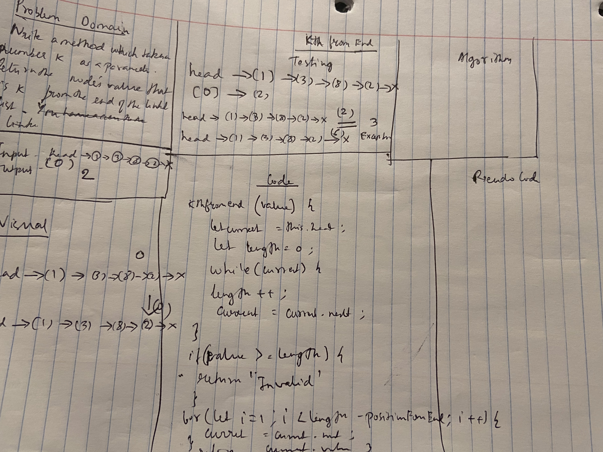

# Code Challenge: Class 08

## Linked List ll-Kth From the End

### Author: Shubham Majumdar

### Links and Resources
* [submission PR](https://github.com/401-advanced-javascript-Shubham/Lab01/pull/1)

# Challenge Summary
Write a method for the Linked List class which takes a number, k, as a parameter. Return the node’s value that is k from the end of the linked list. You have access to the Node class and all the properties on the Linked List class as well as the methods created in previous challenges.
## Challenge Description
Write a method for the Linked List class which takes a number, k, as a parameter. Return the node’s value that is k from the end of the linked list. You have access to the Node class and all the properties on the Linked List class as well as the methods created in previous challenges.

## Approach & Efficiency

## Solution

#### How to initialize/run your server app (where applicable)
* `npm start`
  
#### Tests
* How do you run tests?
npm test

Reference - https://codereview.stackexchange.com/questions/211380/singly-linked-list-implementation-in-es6
https://codeburst.io/linked-lists-in-javascript-es6-code-part-1-6dd349c3dcc3
https://www.geeksforgeeks.org/implementation-linkedlist-javascript/
