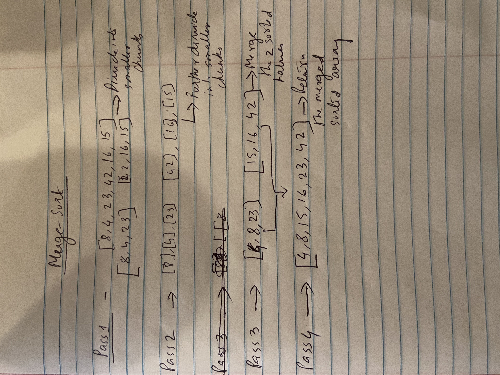

# Code Challenge 22: Merge Sort

## Merge sort

### Author: Shubham Majumdar

### Links and Resources
* [submission PR](https://github.com/smajumdar22/data-structures-and-algorithms/pull/66)

# Challenge Summary
Merge sort using recursion

## Challenge Description
Merge sort using recursion

## Approach & Efficiency

## Solution

#### How to initialize/run your server app (where applicable)
* `npm start`
  
#### Tests
* How do you run tests?
npm test

