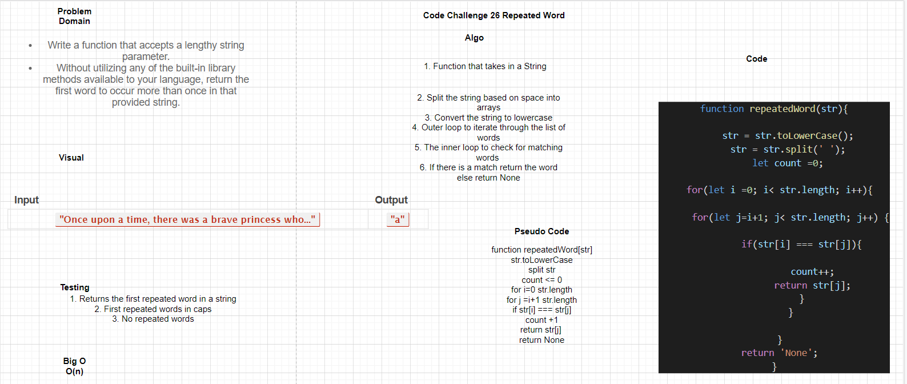

# Code Challenge: Class 26

## Repeated Word

### Author: Shubham Majumdar

### Links and Resources
* [submission PR](https://github.com/smajumdar22/data-structures-and-algorithms/pull/70)

# Challenge Summary
Write a function that accepts a lengthy string parameter.
Without utilizing any of the built-in library methods available to your language, return the first word to occur more than once in that provided string.
Return the new tree.
## Challenge Description
Takes an input string
Converting the string into lowercase.
Using two loops to find duplicate words. First loop will select a word and  and inner loop will compare the word selected by outer loop with rest of the words.the second word
If a match found, then increment the count by 1 and set the duplicates of word to '0' to avoid counting it again.
After the inner loop, if count of a word is greater than 1 which signifies that the word has duplicates in the string.On getting the first match lop is broken and that word is returned.In case of no repetade words NOne is returned.

## Approach & Efficiency

## Solution

#### How to initialize/run your server app (where applicable)
* `npm start`
  
#### Tests
* How do you run tests?
npm test

