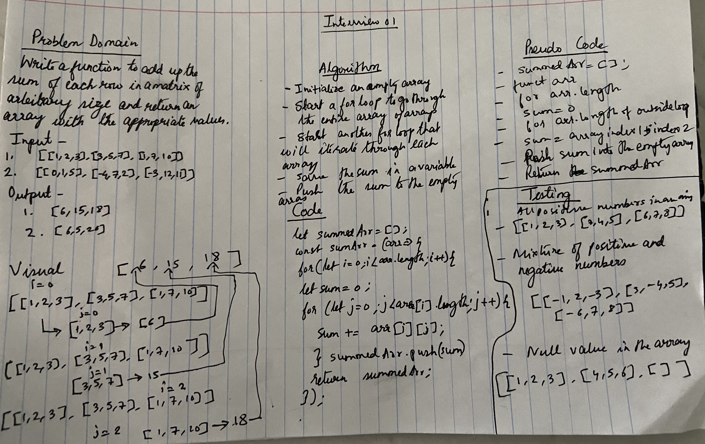

# Code Challenge: Interview 1

## Sum of each row of a matrix

### Author: Shubham Majumdar

### Links and Resources
* [submission PR](https://github.com/smajumdar22/data-structures-and-algorithms/pull/51)

# Challenge Summary
 Write a function to add up the sum of each row in a matrix of arbitrary size, and return an array with the appropriate values.

## Challenge Description
 write a function to add up the sum of each row in a matrix of arbitrary size, and return an array with the appropriate values.
 Avoid utilizing any of the built-in methods available in Java Script.
 The matrix will always be full of integers.
 Negative values are possible.
 All nulls will be counted as zeros.

## Approach & Efficiency
Initialized an empty array to hold the sum.Initialized a loop to loop through the main array.Then initialize another loop to loop through the arrays within the main array.Then read each value from the array and get the sum  of the elements in the array.Push the sum into the empty array to hold all the sum.The outside loop will go on until it iterates through all the arrays.

## Solution

#### How to initialize/run your server app (where applicable)
* `npm start`
  
#### Tests
* How do you run tests?
npm test

