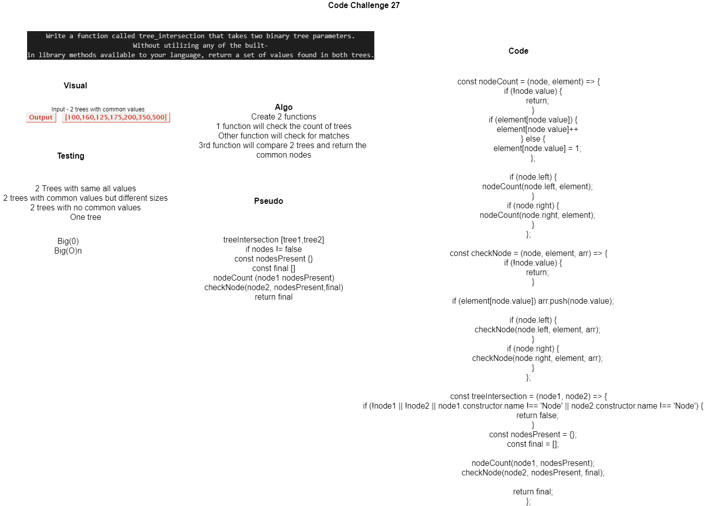

# Code Challenge 27: Tree Intersection

## Tree Intersection

### Author: Shubham Majumdar

### Links and Resources
* [submission PR](https://github.com/smajumdar22/data-structures-and-algorithms/pull/72)
* [Github Actions](https://github.com/smajumdar22/data-structures-and-algorithms/actions)

# Challenge Summary
Write a function called tree_intersection that takes two binary tree parameters.
Without utilizing any of the built-in library methods available to your language, return a set of values found in both trees.

## Challenge Description
Write a function called tree_intersection that takes two binary tree parameters.
Without utilizing any of the built-in library methods available to your language, return a set of values found in both trees.

## Approach & Efficiency

## Solution

#### How to initialize/run your server app (where applicable)
* `npm start`
  
#### Tests
* How do you run tests?
npm test

